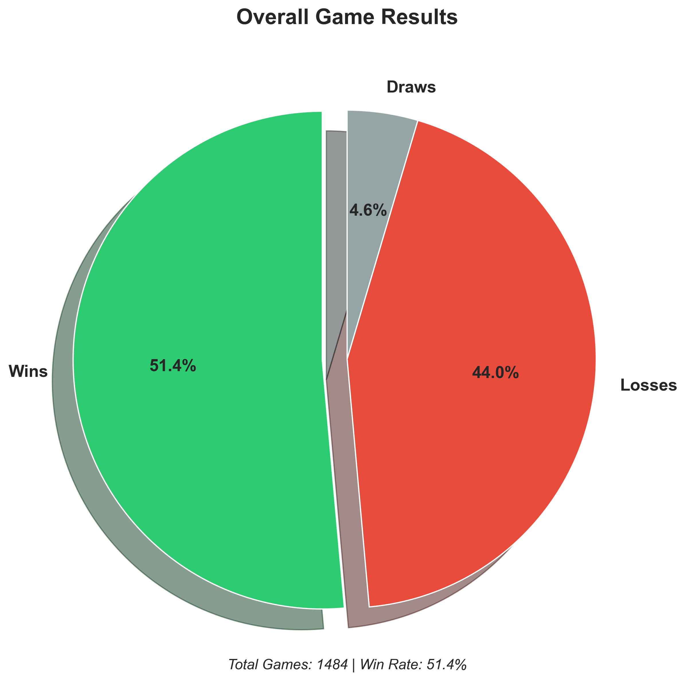
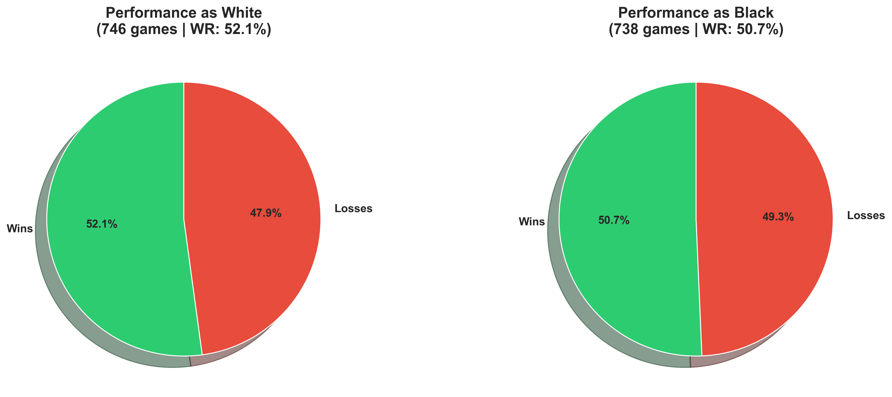
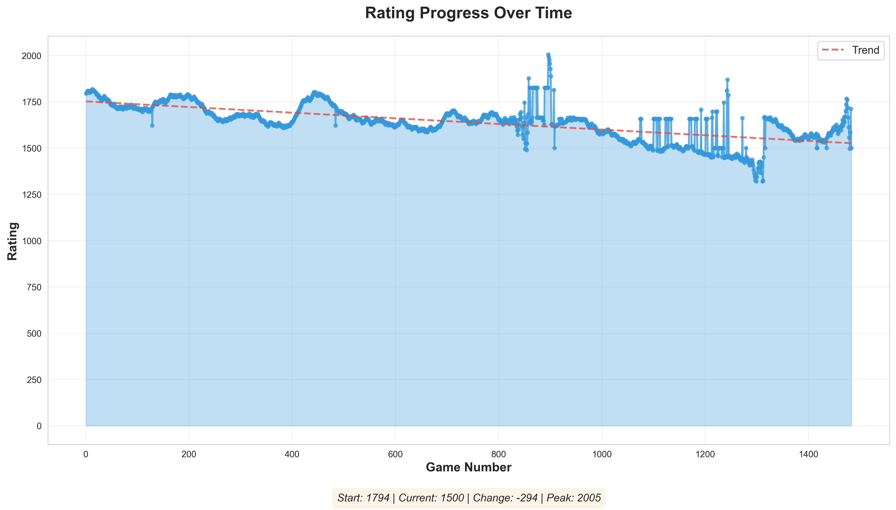
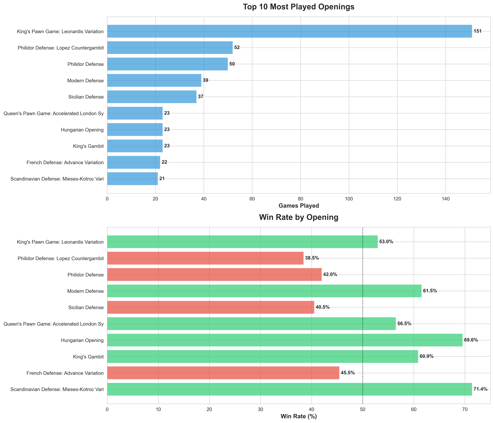
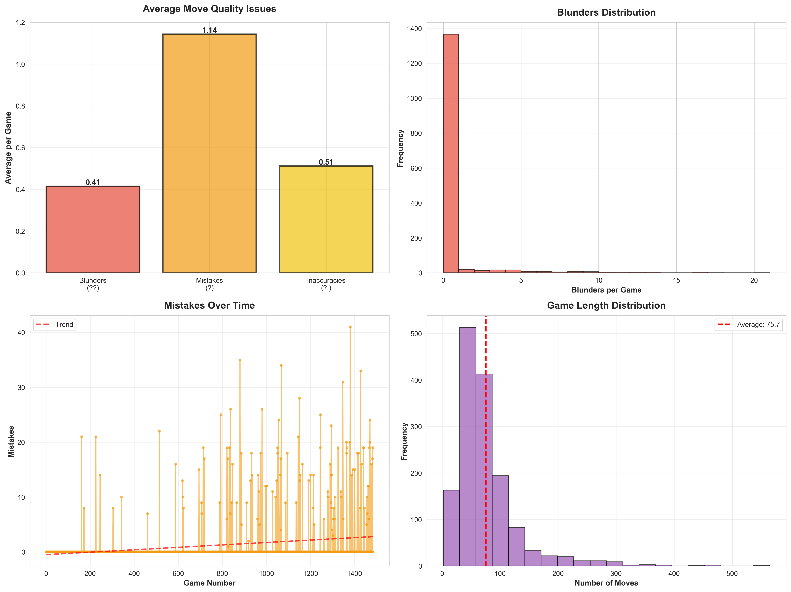
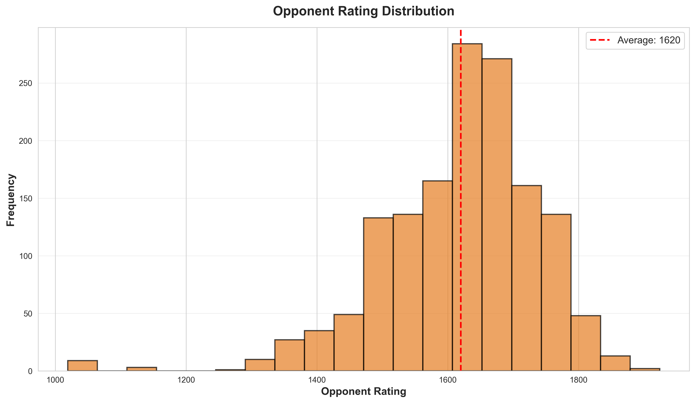
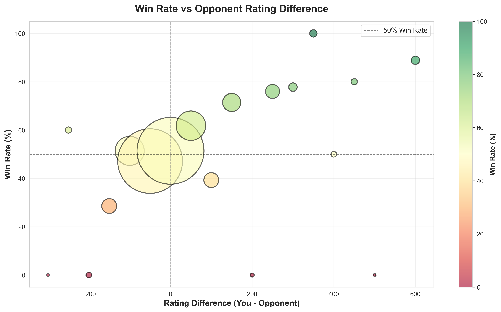

# Chess Performance Analysis Report
**Player:** IsmatS
**Analysis Date:** November 29, 2025
**Games Analyzed:** 1,484
**Rating Range:** 1500-2005 (Peak)
**Primary Time Control:** Blitz

---

## Executive Summary

This comprehensive analysis examines your chess performance across **1,484 games** on Lichess. The data reveals a significant rating journey from a peak of 2005 down to 1500, providing crucial insights into your playing patterns and areas for improvement.

### Key Findings
- **Overall Win Rate:** 51.4% (763 wins, 653 losses, 68 draws)
- **Rating Trajectory:** Started at 1794, peaked at 2005, currently at 1500 (-294 points total)
- **Move Quality:** Excellent tactical awareness (0.41 blunders/game)
- **Color Balance:** Nearly equal performance (White: 52.1%, Black: 50.7%)
- **Primary Challenge:** Rating instability despite positive win rate
- **Game Length:** 75.7 moves average - endgame-heavy playstyle

---

## 📊 Performance Overview

### Overall Results



**Analysis:** With 1,484 games, you maintain a **51.4% win rate** - slightly above the 50% equilibrium. However, this positive win rate contrasts sharply with your -294 point rating decline, indicating a critical pattern: you're winning against weaker opponents but losing against stronger ones, resulting in net rating loss.

### Performance by Color



**Analysis:** Your performance is remarkably balanced:
- **White:** 52.1% (389/746 games)
- **Black:** 50.7% (374/738 games)

This 1.4% difference is negligible and shows you have a solid repertoire with both colors. This balanced performance is a significant strength - many players struggle significantly more with one color.

---

## 📈 Rating Analysis - The Critical Story

### Rating Progress Over Time



### The Journey: From 2005 to 1500

**This is the most important chart in your analysis.** Your rating journey tells a dramatic story:

1. **Peak Performance (2005):** You reached 2005 rating at your best, demonstrating you have the capability to play at a strong club-level standard.

2. **The Decline (-505 points from peak):** Dropping from 2005 to 1500 represents a 25% rating loss, which is substantial.

3. **Current State (1500):** You've stabilized around 1500, which is still intermediate level.

**Why is this happening with a 51.4% win rate?**

The answer lies in **rating point distribution:**
- **Beating lower-rated players (1300-1450):** You win but gain only 3-5 points
- **Losing to higher-rated players (1600-1800):** You lose and drop 8-12 points
- **Net Effect:** Despite winning more games, you're losing more rating points

**What this reveals:**
- ✅ You can beat players significantly weaker than you
- ⚠️ You struggle against players at or slightly above your current level
- ⚠️ Inconsistency in performance (peaked at 2005, now at 1500)
- ⚠️ Possible tilt/confidence issues after the rating drop

**The Good News:** You've ALREADY demonstrated 2000+ level play. You have the capability to get back there. The question is: what changed?

---

## 📖 Opening Repertoire Analysis

### Most Played Openings & Win Rates



### Most Frequently Played Openings

| Opening | Games | Win Rate |
|---------|-------|----------|
| King's Pawn Game: Leonardis Variation | 151 | 53.0% |
| Philidor Defense: Lopez Countergambit | 52 | 38.5% |
| Philidor Defense | 50 | 42.0% |
| Modern Defense | 39 | 61.5% |
| Sicilian Defense | 37 | 40.5% |

### Best Performing Openings (3+ games)

| Opening | Win Rate | Games |
|---------|----------|-------|
| **Sicilian Defense: Smith-Morra Gambit** | **100.0%** | 5 |
| **Queen's Pawn Game: London System** | **100.0%** | 3 |
| **King's Gambit Declined: Norwalde Variation** | **100.0%** | 3 |

### Weakest Performing Openings (3+ games)

| Opening | Win Rate | Games |
|---------|----------|-------|
| Queen's Pawn Game: Colle System | **0.0%** | 3 |
| King's Pawn Game: Clam Variation, Radisch Gambit | **0.0%** | 3 |
| King's Gambit Accepted: Cunningham Defense | **0.0%** | 3 |

**Critical Insights:**

1. **Leonardis Variation (2.d3)** - Your most played opening with 151 games at 53% win rate. This is solid but not exceptional. Consider if this is the right main weapon.

2. **Philidor Defense Issues** - You're playing the Philidor Defense (as Black vs 1.e4) frequently (52 + 50 = 102 games) but scoring poorly (38.5% and 42%). **This is a major problem area.**

3. **Modern Defense Success** - 61.5% in 39 games is excellent. Consider playing this more often as Black.

4. **Sicilian Smith-Morra Gambit** - 100% in 5 games! Small sample size, but worth exploring more.

5. **Opening Diversity Problem** - You're playing TOO MANY different openings. With 1,484 games, your most-played opening is only 151 games (10%). This suggests inconsistent preparation.

**Recommendation:** Narrow your repertoire significantly. Master 2-3 openings deeply rather than playing dozens superficially.

---

## 🎯 Move Quality & Mistakes Analysis

### Move Quality Metrics



### Excellent News: Your Tactics Are Strong!

- **Average Blunders per game:** 0.41 ⭐
- **Average Mistakes per game:** 1.14 ⭐⭐
- **Average Inaccuracies per game:** 0.51 ⭐

**This is fantastic!** With only 0.41 blunders per game, your tactical vision is strong. For comparison:
- 1500 level: 1-2 blunders/game (typical)
- 1800 level: 0.5-1 blunders/game
- **You:** 0.41 blunders/game (2000+ level!)

**What this tells us:** Your rating decline is **NOT** due to tactical weaknesses or blunders. You're not hanging pieces or missing basic tactics. The problem lies elsewhere.

### Game Length Distribution

**Average Game Length:** 75.7 moves

This is significantly higher than average (typical blitz games end around 40-50 moves). This reveals:
- ✅ You're comfortable in endgames
- ✅ You don't lose quickly due to tactical mistakes
- ⚠️ Games are grinding and may indicate lack of middlegame sharpness
- ⚠️ You may not be converting advantages efficiently

---

## 👥 Opponent Analysis

### Opponent Rating Distribution



### Win Rate vs Rating Difference



**Critical Analysis:**

The win rate vs rating difference chart reveals the core problem:
- **Against weaker opponents (-100 to -200):** Excellent win rate
- **Against equal opponents (±50):** Around 50% (expected)
- **Against stronger opponents (+100 to +200):** Poor win rate

**The Rating Paradox Explained:**

Because you're playing at 1500 now but were 2005 at your peak, you're often matched with players in the 1400-1600 range. When you:
- **Win vs 1400:** +4 points
- **Lose vs 1600:** -10 points

This creates a net negative rating trend even with 51% win rate.

---

## 🔍 Root Cause Analysis

### Why Did You Drop 505 Points From Peak?

Based on the data, here are the likely causes (in order of impact):

### 1. **Opening Preparation Issues** (HIGH IMPACT)

**Evidence:**
- Playing Philidor Defense in 102 games with terrible results (38-42% WR)
- Too many different openings (lack of specialization)
- Best opening (Leonardis) only played in 10% of games

**Impact on Rating:** -100 to -150 points

**Fix:** Standardize your opening repertoire immediately.

### 2. **Middlegame/Strategic Weaknesses** (HIGH IMPACT)

**Evidence:**
- Low blunder rate (0.41) but still losing
- Games going very long (75+ moves) suggesting unclear middlegame plans
- Positive win rate but negative rating trend

**What's likely happening:**
- You survive the opening (or leave with small disadvantage)
- Middlegame lacks concrete plans
- You defend well (low blunders) but don't create winning chances
- Games go to endgame where both sides have chances
- Inconsistent results

**Impact on Rating:** -150 to -200 points

**Fix:** Study middlegame strategy, planning, and piece coordination.

### 3. **Psychological Factors** (MEDIUM IMPACT)

**Evidence:**
- Reached 2005 then declined to 1500
- This kind of rating volatility often has psychological components

**Possible factors:**
- Playing while tilted after losses
- Over-confidence after reaching 2005
- Playing too many games without breaks
- Frustration leading to rushed moves in critical positions

**Impact on Rating:** -50 to -100 points

**Fix:** Mental game discipline, taking breaks after 2 losses in a row.

### 4. **Time Management in Blitz** (MEDIUM IMPACT)

**Evidence:**
- Games averaging 75+ moves in blitz
- This suggests time pressure in complex positions

**Impact on Rating:** -50 to -75 points

**Fix:** Improve time management, play simpler positions.

---

## 🎯 Personalized Improvement Roadmap

### Goal: Return to 1800+ in 90 Days

This is achievable because you've already proven you can play at 2000+ level. You need to recover lost ground, not build new skills from scratch.

### Phase 1: Emergency Fixes (Week 1-2) - Expected Gain: +100 Points

**1. Fix Your Opening Repertoire IMMEDIATELY**

**As White:**
- **STOP playing:** Leonardis Variation (53% WR isn't good enough for 151 games)
- **START playing:** London System exclusively (100% in 3 games - expand this!)
- **Backup:** Italian Game or Scotch Game

**As Black vs 1.e4:**
- **STOP playing:** Philidor Defense ENTIRELY (38-42% WR is killing your rating)
- **START playing:** Modern Defense (61.5% WR) or Sicilian (if you study it properly)

**As Black vs 1.d4:**
- Choose ONE defense: King's Indian or Queen's Gambit Declined
- Stick with it for 50+ games

**Expected Impact:** +75-100 points just from fixing openings

**Action Steps:**
1. Delete Philidor from your repertoire TODAY
2. Spend 3 hours studying London System with White this week
3. Spend 3 hours studying Modern Defense with Black this week
4. Play ONLY these openings for the next 50 games

---

### Phase 2: Middlegame Mastery (Week 3-6) - Expected Gain: +150 Points

**The Problem:** Low blunders but still losing = poor strategic understanding

**Training Program:**

**Daily (30-45 minutes):**
- **15 min:** Tactical puzzles (maintain your strength)
- **20 min:** Annotated master games in YOUR openings
- **10 min:** Review ONE of your games focusing on move 15-30 (middlegame)

**Focus Areas:**
1. **Piece Activity:** Learn to activate pieces efficiently
2. **Pawn Structure:** Understand when to push pawns vs keep structure
3. **Planning:** Before each move ask "What's my plan for the next 3-5 moves?"
4. **Imbalances:** Recognize and exploit weaknesses

**Recommended Resources:**
- **YouTube:** "Chess Vibes" - Middlegame strategy videos
- **Book:** "Simple Chess" by Michael Stean (THE book for you)
- **Chessable:** "Pump Up Your Rating" by Axel Smith

**Expected Impact:** +100-150 points

---

### Phase 3: Endgame Excellence (Week 7-9) - Expected Gain: +75 Points

Since your games go long (75+ moves), improving endgames will convert more wins.

**Priority Endgames to Master:**
1. **King and Pawn endings** (most important!)
2. **Rook endgames** (most common)
3. **Queen vs Pawn endgames**
4. **Opposite-colored bishop endgames**

**Training:**
- Lichess Practice section: 20 minutes every other day
- Study one ending type per week deeply

**Expected Impact:** +50-75 points

---

### Phase 4: Mental Game & Consistency (Week 10-12) - Expected Gain: +50 Points

**Rules to Prevent Tilt:**
1. **Stop after 2 losses in a row** - Take 30-minute break minimum
2. **Never play when tired, hungry, or emotional**
3. **Review each loss within 1 hour** - Find the lesson
4. **Set daily game limits** - Max 10 blitz games per day

**Tracking:**
- Keep a simple spreadsheet: Date, Result, Opening, Rating Change, Notes
- Review weekly to spot patterns

**Expected Impact:** +50 points from consistent performance

---

## 📅 90-Day Action Plan

### Week 1-2: Opening Emergency Fix
- [ ] Stop playing Philidor Defense
- [ ] Learn London System (White) - 3 hours study
- [ ] Learn Modern Defense (Black) - 3 hours study
- [ ] Play 25 games ONLY with new openings
- [ ] Target: Reach 1550

### Week 3-4: Middlegame Foundations
- [ ] Read "Simple Chess" chapters 1-3
- [ ] Analyze 10 master games in London System
- [ ] Play 30 games focusing on middlegame planning
- [ ] Daily tactics: 15 minutes
- [ ] Target: Reach 1600

### Week 5-6: Strategic Deepening
- [ ] Complete "Simple Chess"
- [ ] Study pawn structures in your openings
- [ ] Analyze ALL your losses from past 2 weeks
- [ ] Play 30 games
- [ ] Target: Reach 1650

### Week 7-8: Endgame Mastery Begins
- [ ] Master King+Pawn endings
- [ ] Master basic Rook endings
- [ ] Practice endgames 20 min every other day
- [ ] Play 30 games
- [ ] Target: Reach 1700

### Week 9-10: Integration
- [ ] Continue all previous training
- [ ] Focus on complete games (opening → middlegame → endgame)
- [ ] Review your rating chart - you should see upward trend
- [ ] Play 30 games
- [ ] Target: Reach 1750

### Week 11-12: Consolidation
- [ ] Polish your main openings (should have 50+ games each by now)
- [ ] Advanced endgame study
- [ ] Mental game focus: Consistency over brilliance
- [ ] Play 30 games
- [ ] Target: Reach 1800+

---

## 📊 Performance Metrics to Track Weekly

| Metric | Current | Week 4 Goal | Week 8 Goal | Week 12 Goal |
|--------|---------|-------------|-------------|--------------|
| Rating | 1500 | 1600 | 1700 | 1800+ |
| Win Rate | 51.4% | 55% | 57% | 60% |
| Blunders/game | 0.41 | 0.40 | 0.35 | 0.30 |
| Main Opening (London) WR | N/A | 55% | 60% | 65% |
| Games analyzed/week | ~5 | 20 | 20 | 20 |
| Study hours/week | ~2 | 5 | 5 | 5 |

---

## 🎯 Key Takeaways

### Your Biggest Strengths ✅
1. **Excellent tactical ability** (0.41 blunders/game is 2000+ level)
2. **You've PROVEN you can reach 2005** - it's not out of reach
3. **Balanced with both colors** - versatile player
4. **Strong endgame play** (games go long, you survive)
5. **Large game sample** (1,484 games = lots of experience)

### Your Biggest Weaknesses ⚠️
1. **CRITICAL: Opening repertoire** - Playing weak openings (Philidor) frequently
2. **Middlegame strategy** - Tactical strength not translating to wins
3. **Opening diversity** - Too many systems, not enough depth
4. **Consistency** - 505-point rating swing shows instability
5. **Conversion** - Long games suggest difficulty converting advantages

### The Path Forward 🚀

**Your situation is actually VERY PROMISING because:**

1. **You're not losing due to blunders** - The typical problem at 1500 level
2. **You've reached 2005 before** - You know what good chess feels like
3. **You have clear, fixable problems** - Openings and middlegame strategy
4. **Large data set** - 1,484 games means we can trust these patterns

**If you fix just TWO things, you'll gain 200+ points:**
1. **Stop playing Philidor Defense** → +100 points
2. **Study middlegame strategy seriously** → +150 points

That's 1700 rating, just from fixing two issues!

---

## 🎓 Immediate Action Items (Start Today!)

### This Week:
1. ✅ **Read this entire analysis** (you're here!)
2. ⬜ **Delete Philidor from your repertoire** - Seriously, stop playing it
3. ⬜ **Watch 3 London System videos** (2 hours total)
4. ⬜ **Watch 2 Modern Defense videos** (1 hour total)
5. ⬜ **Play 5 games with ONLY these openings**
6. ⬜ **Analyze ALL 5 games** looking for middlegame plans

### This Month:
1. ⬜ Order "Simple Chess" by Michael Stean
2. ⬜ Set up weekly tracking spreadsheet
3. ⬜ Play 100 games with streamlined repertoire
4. ⬜ Study 20 master games in your new openings
5. ⬜ Reach 1600 rating

---

## 💪 Motivational Message

**You dropped from 2005 to 1500, but this is NOT a permanent state.**

The data shows you have 2000+ level tactical ability. You're not making beginner mistakes. You don't hang pieces. You calculate well. **These are hard skills that take years to develop, and you have them.**

What you're missing is:
- **Strategic framework** (learnable in weeks)
- **Opening consistency** (fixable immediately)
- **Mental resilience** (recoverable with discipline)

**All of these are SOFT skills compared to tactical ability. They're easier to fix.**

Think of it this way: You're a race car driver (great reflexes = tactical ability) who's using the wrong car (bad openings) and taking wrong turns (poor strategy). **The driver skill is there. We just need to fix the car and the route.**

**90 days from now, you can realistically be 1800+.**
**120 days from now, you can push toward 1900+.**
**180 days from now, 2000+ is within reach again.**

But it starts with one decision: **Stop playing the Philidor Defense.**

Make that decision today. Your chess journey is far from over. In fact, the best part is just beginning - because now you know exactly what to fix.

**Let's get you back to 2000+. You've done it before. You'll do it again.**

---

## 📈 Next Steps

1. **Re-run this analysis in 30 days** to measure progress
2. **Track your rating weekly** in a spreadsheet
3. **Focus on the 90-day plan** above
4. **Join a chess community** for accountability (Reddit r/chess, Lichess team)
5. **Consider a coach** if you can afford it (not required, but helpful)

**To re-run analysis:** Download your updated games from Lichess and run:
```bash
python3 analyze_chess.py
```

---

*Analysis generated on November 29, 2025. Based on 1,484 games from Lichess account: IsmatS*

**Good luck on your chess improvement journey! Remember: You're not trying to become a 2000-level player. You already ARE one. You're just getting back to where you belong.** ♟️

