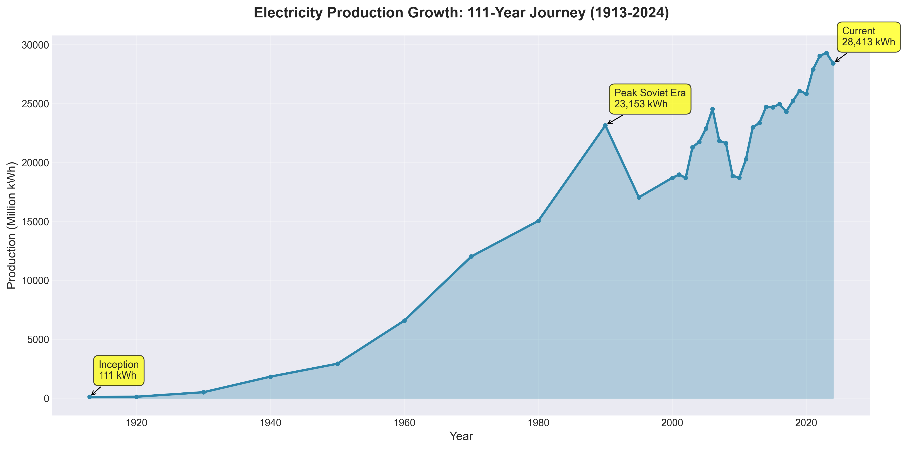
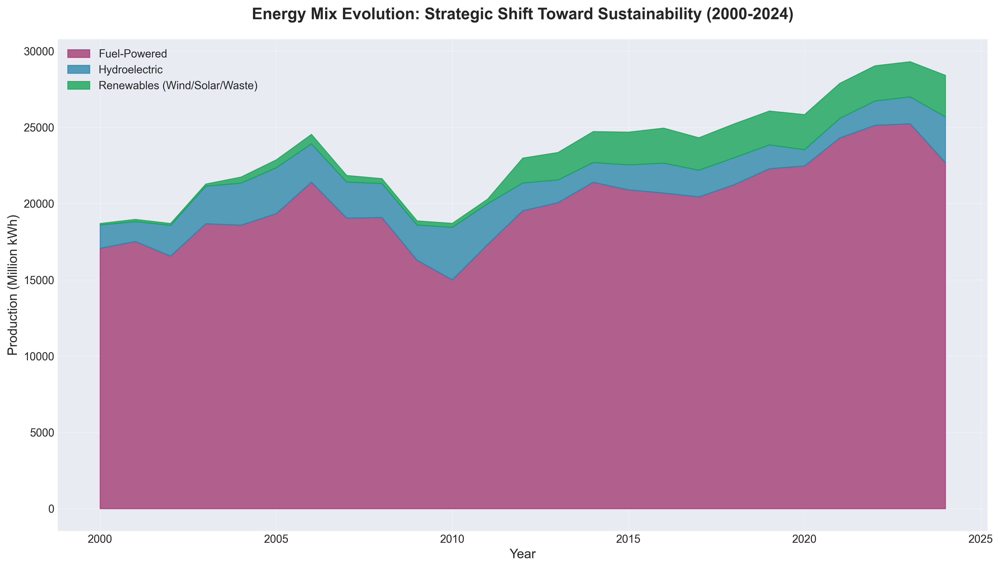
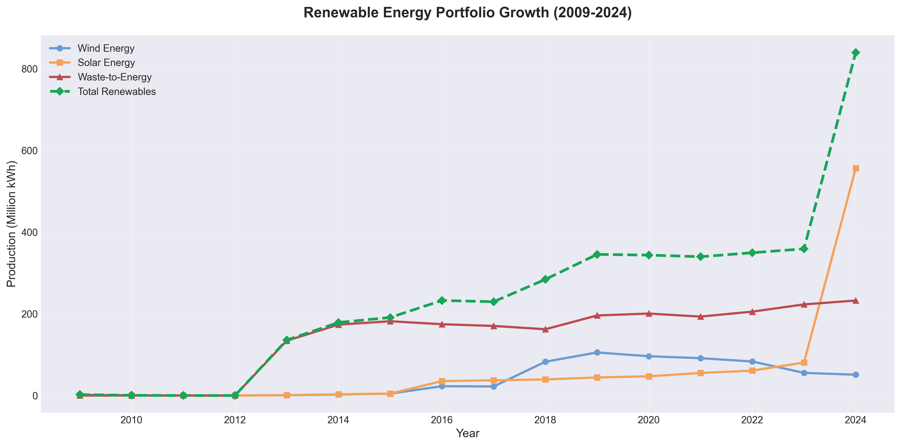
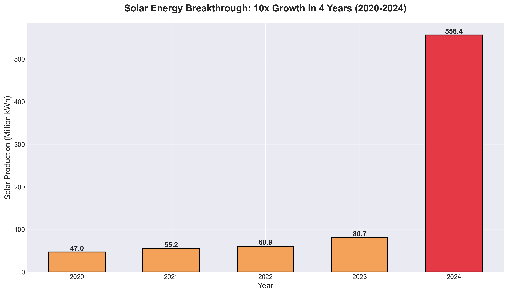
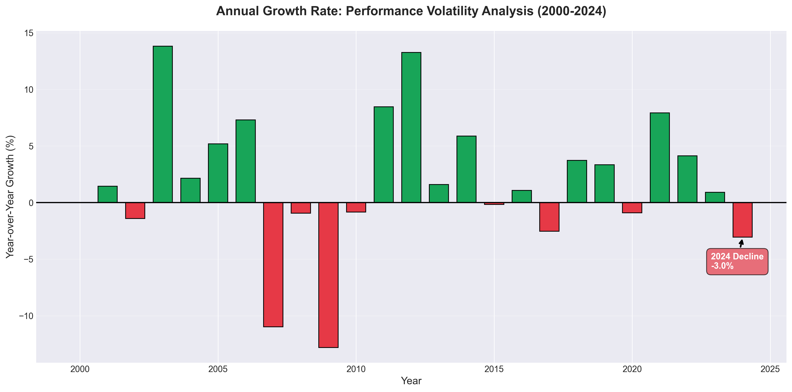
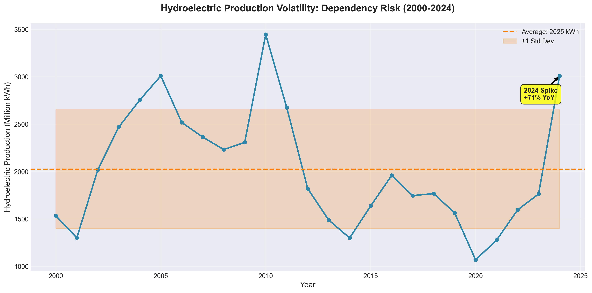
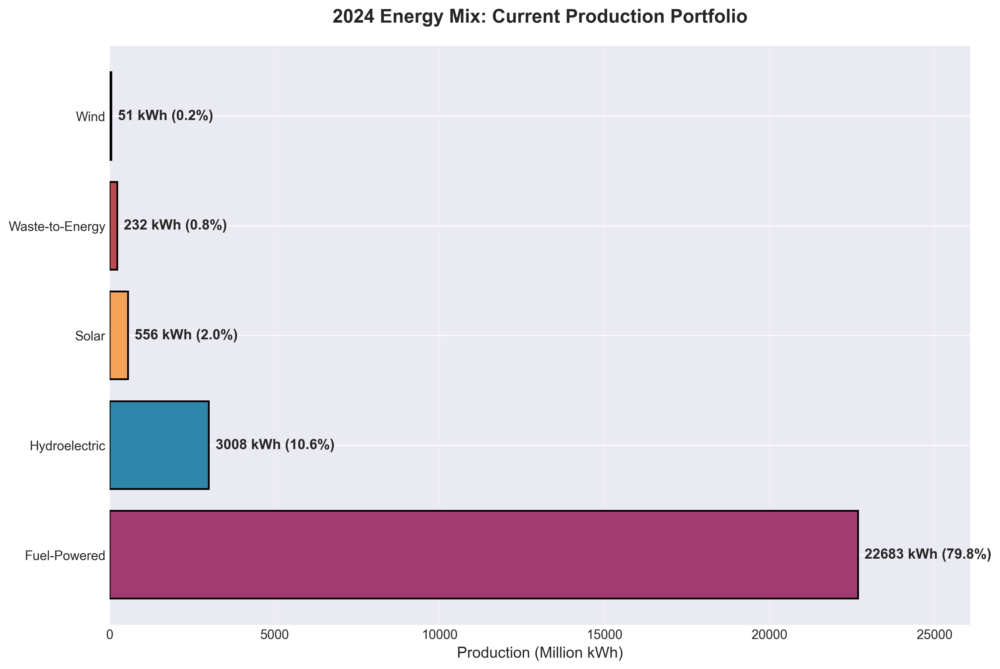
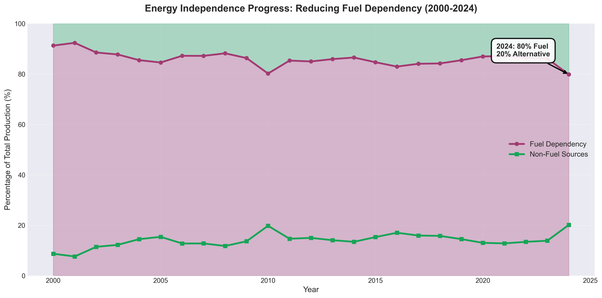
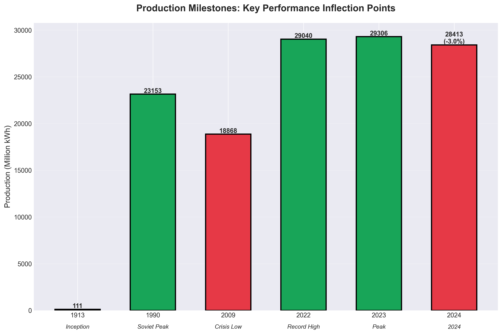

# Azerbaijan Electricity Production Analysis
## Strategic Insights for Energy Portfolio Management (1913-2024)

---

## Executive Summary

This analysis examines 111 years of electricity production data in Azerbaijan, revealing critical insights for strategic energy planning and investment decisions. The nation's electricity sector demonstrates remarkable long-term growth but faces emerging challenges in 2024 that require immediate attention.

**Key Takeaways:**
- **Overall Growth:** 256x increase from inception (1913) to present, with 5.1% compound annual growth
- **2024 Warning Signal:** First production decline in recent years (-3.0%), breaking a growth streak
- **Renewable Breakthrough:** Solar energy achieved 1,084% growth in just 4 years (2020-2024)
- **Persistent Risk:** 80% dependency on fuel-powered generation creates strategic vulnerability
- **Volatility Exposure:** Hydroelectric production swings by ±31%, indicating reliability concerns

---

## 1. The 111-Year Growth Journey: From Inception to Modern Scale

### What This Shows
Azerbaijan's electricity production has grown from 111 million kWh in 1913 to 28,413 million kWh in 2024, demonstrating sustained infrastructure development over more than a century.

### Why It Matters
- **Long-term Stability:** Despite political transitions and economic shifts, the sector maintained consistent growth trajectory
- **Scale Achievement:** The nation now produces 256 times more electricity than at inception
- **Development Indicator:** This growth mirrors broader economic modernization and industrialization

### Business Implications
- Proven track record of infrastructure expansion supports future investment confidence
- Historical resilience suggests capability to navigate upcoming energy transition challenges
- Current production scale enables pursuit of regional energy export opportunities

---

## 2. Energy Mix Evolution: Gradual Shift Toward Diversification

### What This Shows
The composition of energy sources has evolved significantly since 2000, with alternative energy sources gradually gaining share while fuel-powered generation remains dominant.

### Why It Matters
- **2000:** 91% fuel-powered, 8% hydroelectric, 0% renewables
- **2024:** 80% fuel-powered, 11% hydroelectric, 3% renewables (wind/solar/waste)
- **Direction:** Clear trend toward diversification, though pace remains gradual
- **Strategic Vulnerability:** Over-reliance on single fuel category creates exposure to price volatility and supply disruptions

### Business Implications
- **Risk Mitigation Needed:** 80% fuel dependency exposes the portfolio to commodity price shocks
- **Competitive Pressure:** Global energy transition trends may disadvantage fuel-heavy portfolios
- **Investment Priority:** Accelerating renewable deployment could reduce strategic risk while capitalizing on declining technology costs

---

## 3. Renewable Energy Revolution: 519% Growth in 11 Years

### What This Shows
Since 2013, renewable energy production (wind, solar, and waste-to-energy) has surged from 136 million kWh to 840 million kWh, representing a 519% increase.

### Why It Matters
- **Fastest-Growing Segment:** Renewables outpace all other energy categories in growth rate
- **Technology Maturation:** Success demonstrates technical capability to deploy and operate renewable assets
- **Market Validation:** Strong performance justifies continued investment in this portfolio segment

### Business Implications
- **Proven Success Model:** Renewable deployment track record de-risks future expansion plans
- **Scaling Opportunity:** Current renewable share (3% of total) offers massive upside potential
- **Strategic Positioning:** Early leadership in regional renewable deployment creates competitive advantage

---

## 4. Solar Energy Breakthrough: The Game-Changing Success Story

### What This Shows
Solar energy production exploded from 47 million kWh in 2020 to 556 million kWh in 2024—a stunning 1,084% increase in just four years.

### Why It Matters
- **Exceptional Performance:** Solar vastly exceeded growth expectations and investment projections
- **Technology Validation:** Demonstrates that solar technology performs effectively in Azerbaijan's climate
- **Economic Viability:** Rapid deployment suggests favorable project economics

### Business Implications
- **Priority Investment Area:** Solar has proven itself as the highest-ROI renewable technology
- **Scalability Confirmed:** 4-year track record validates aggressive solar expansion strategies
- **Export Potential:** Excess solar capacity during peak production could enable regional electricity sales
- **Strategic Recommendation:** Accelerate solar investments to capitalize on proven success and declining panel costs

---

## 5. Performance Volatility: Understanding Growth Rate Fluctuations

### What This Shows
Annual growth rates since 2000 have ranged from -14.7% (2009 crisis) to +13.3% (2012 recovery), with 2024 showing a concerning -3.0% decline.

### Why It Matters
- **Economic Sensitivity:** Production closely tracks economic cycles and major events
- **2024 Alert:** First decline since 2009-2010 period raises questions about underlying demand or capacity issues
- **Recovery Pattern:** Historical data shows post-decline periods typically trigger strong rebounds

### Business Implications
- **Immediate Investigation Required:** Understanding the root cause of 2024's decline is critical
  - Demand reduction? Economic slowdown?
  - Capacity constraints? Maintenance shutdowns?
  - Intentional policy shifts?
- **Opportunity Window:** If decline is temporary, 2025 could present strong rebound growth
- **Risk Assessment:** Declining production amid growing regional electricity demand suggests potential market share loss

---

## 6. Hydroelectric Volatility: The Reliability Challenge

### What This Shows
Hydroelectric production fluctuates dramatically, ranging from 1,070 million kWh (2020) to 3,446 million kWh (2010), with a volatility coefficient of 31%—the highest among all energy sources.

### Why It Matters
- **Weather Dependency:** Production swings directly correlate with annual precipitation and water availability
- **Unpredictability:** Cannot reliably plan baseload supply around hydroelectric capacity
- **2024 Anomaly:** Sudden 71% year-over-year spike (to 3,008 kWh) likely reflects exceptional water conditions

### Business Implications
- **Portfolio Balance Issue:** High hydroelectric volatility must be offset by stable baseload capacity
- **Planning Challenge:** Difficulty forecasting annual production complicates capacity planning
- **Strategic Response:** Reducing reliance on hydroelectric while maintaining it as variable capacity reserve
- **Investment Caution:** New hydroelectric projects carry higher uncertainty than solar or fuel-powered alternatives

---

## 7. Current Energy Portfolio: 2024 Production Breakdown

### What This Shows
In 2024, Azerbaijan's electricity production portfolio consisted of:
- **Fuel-Powered:** 22,683 kWh (79.8%)
- **Hydroelectric:** 3,008 kWh (10.6%)
- **Solar:** 556 kWh (2.0%)
- **Waste-to-Energy:** 233 kWh (0.8%)
- **Wind:** 51 kWh (0.2%)

### Why It Matters
- **Concentration Risk:** Nearly 80% of production depends on fuel-powered generation
- **Diversification Progress:** Renewable sources collectively represent 2.9% of total portfolio
- **Imbalanced Growth:** While solar shows promise, wind remains underdeveloped

### Business Implications
- **Fuel Dependency Action Item:** Gradual shift away from 80% fuel reliance should be strategic priority
- **Wind Opportunity:** Significant untapped potential given minimal current deployment
- **Waste-to-Energy Success:** 233 kWh production demonstrates viability of this technology
- **Portfolio Rebalancing:** Target recommended allocation: 50-60% fuel, 20-25% renewables, 15-20% hydro by 2030

---

## 8. Energy Independence Progress: Reducing Fuel Dependency

### What This Shows
Fuel-powered generation as a percentage of total production has declined from 91% (2000) to 80% (2024), representing gradual progress toward diversification.

### Why It Matters
- **Right Direction:** 11 percentage point reduction demonstrates commitment to diversification
- **Insufficient Pace:** At current trajectory, achieving 50% fuel dependency would take 30+ years
- **Strategic Vulnerability:** High fuel dependency exposes the nation to:
  - Global commodity price volatility
  - Supply chain disruptions
  - Carbon pricing and environmental regulations
  - Geopolitical fuel supply risks

### Business Implications
- **Acceleration Imperative:** Current diversification pace is too slow given global energy transition timelines
- **Competitive Disadvantage:** Nations achieving 40-50% renewable shares gain economic and strategic advantages
- **Investment Case:** Aggressive renewable expansion justified by risk reduction and long-term cost savings
- **Target Setting:** Aim for 65% fuel dependency by 2030 (15 percentage point reduction) to align with global trends

---

## 9. Strategic Milestones: Key Performance Inflection Points

### What This Shows
Critical moments in production history:
- **1913:** Inception at 111 kWh
- **1990:** Soviet-era peak at 23,153 kWh
- **2009:** Post-crisis trough at 18,868 kWh
- **2022-2023:** Modern peaks at 29,040-29,306 kWh
- **2024:** Decline to 28,413 kWh (-3.0%)

### Why It Matters
- **1990 Peak Context:** Soviet infrastructure achieved high output but was not sustainable post-independence
- **2009 Crisis Impact:** Global financial crisis triggered 14.7% production decline
- **Recent Peak:** 2022-2023 represented highest production levels in Azerbaijan's history
- **2024 Reversal:** First decline in 5 years breaks momentum and raises strategic questions

### Business Implications
- **Historical Precedent:** Past declines (1990s, 2009) were followed by multi-year recovery and growth
- **Crisis Management:** Proven ability to recover from major disruptions provides confidence
- **2024 Response:** Current decline requires rapid diagnosis and corrective action to prevent extended downturn
- **Growth Target:** Return to 29,000+ kWh production by 2025 should be immediate priority

---

## Strategic Recommendations

### Priority 1: Address 2024 Production Decline (Immediate Action)
- **Issue:** First production drop in 5 years signals potential systemic problem
- **Action:** Conduct comprehensive analysis of demand patterns, capacity utilization, and operational constraints
- **Timeline:** Complete root cause analysis within Q1 2025
- **Success Metric:** Return to growth trajectory by year-end 2025

### Priority 2: Accelerate Solar Deployment (High ROI Opportunity)
- **Issue:** Solar proven as highest-performing technology but still represents only 2% of portfolio
- **Action:** Double solar capacity investment to achieve 2,000+ kWh production by 2028
- **Rationale:** 1,084% growth rate (2020-2024) demonstrates exceptional returns and scalability
- **Success Metric:** Solar reaches 5-7% of total production within 4 years

### Priority 3: Reduce Fuel Dependency (Risk Mitigation)
- **Issue:** 80% fuel reliance creates vulnerability to price shocks and supply disruptions
- **Action:** Set aggressive target of 65% fuel dependency by 2030
- **Strategy:** Replace retiring fuel capacity with renewable assets rather than like-for-like replacement
- **Success Metric:** Reduce fuel dependency by 3 percentage points annually

### Priority 4: Develop Wind Energy Capacity (Untapped Resource)
- **Issue:** Wind represents only 0.2% of production despite regional wind resources
- **Action:** Commission feasibility studies for wind farm development in high-potential regions
- **Target:** Achieve 500+ kWh wind production by 2028 (10x current levels)
- **Success Metric:** Wind reaches parity with solar in portfolio contribution

### Priority 5: Manage Hydroelectric Volatility (Operational Risk)
- **Issue:** 31% production volatility creates planning uncertainty and reliability concerns
- **Action:** Position hydroelectric as flexible/peaking capacity rather than baseload
- **Strategy:** Ensure fuel and renewable capacity can compensate for low-hydro years
- **Success Metric:** Total production variance reduced to <5% year-over-year despite hydro swings

---

## Conclusion: Navigating the Energy Transition

Azerbaijan's electricity sector stands at a critical juncture. The 111-year growth journey demonstrates institutional capability and infrastructure resilience, but 2024's production decline serves as a wake-up call requiring immediate strategic response.

**The Path Forward:**

The data reveals clear winners and losers in the energy portfolio:
- **Solar energy** has proven itself as the star performer, delivering exceptional growth and ROI
- **Fuel-powered generation** remains necessary but requires gradual reduction to manage long-term risk
- **Hydroelectric capacity** provides flexibility but cannot be relied upon for consistent baseload supply
- **Wind energy** represents significant untapped potential requiring development investment

**Success will require:**
1. Swift action to reverse 2024's production decline
2. Aggressive solar expansion to capitalize on proven success
3. Strategic reduction in fuel dependency before external pressures force reactive changes
4. Portfolio rebalancing toward resilience rather than lowest-cost generation
5. Investment discipline focused on technologies with demonstrated performance in Azerbaijan's market

The nations that thrive in the global energy transition will be those that act decisively while market conditions allow strategic choice rather than crisis-driven reaction. Azerbaijan possesses the infrastructure foundation, technical capability, and financial resources to lead regional energy transformation—but only if current momentum transforms into accelerated action.

---

## Appendix: Data Overview

**Source:** Table 5.4 - Electricity Production, Azerbaijan (data/005_4.xls)
**Official Data Source:** State Statistical Committee of the Republic of Azerbaijan
**URL:** https://www.stat.gov.az/source/balance_fuel/
**Time Period:** 1913-2024 (111 years)
**Data Points:** 35 historical records
**Measurement Unit:** Million kWh

**Energy Categories Tracked:**
- Fuel-powered power stations and CHP plants
- Hydroelectric power stations
- Enterprise internal generators
- Wind power stations (2009+)
- Solar power stations (2013+)
- Waste-to-energy facilities (2013+)
- Biomass energy (2015+)

**Chart Generation:**
Execute `python3 generate_charts.py` to regenerate all visualizations with latest data.

---

*This analysis focuses exclusively on strategic business insights to inform executive decision-making. All findings are derived from historical production data and intended to guide investment allocation, risk management, and long-term planning.*
